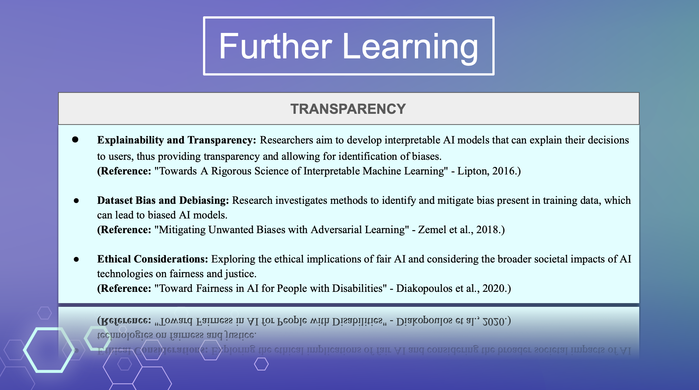
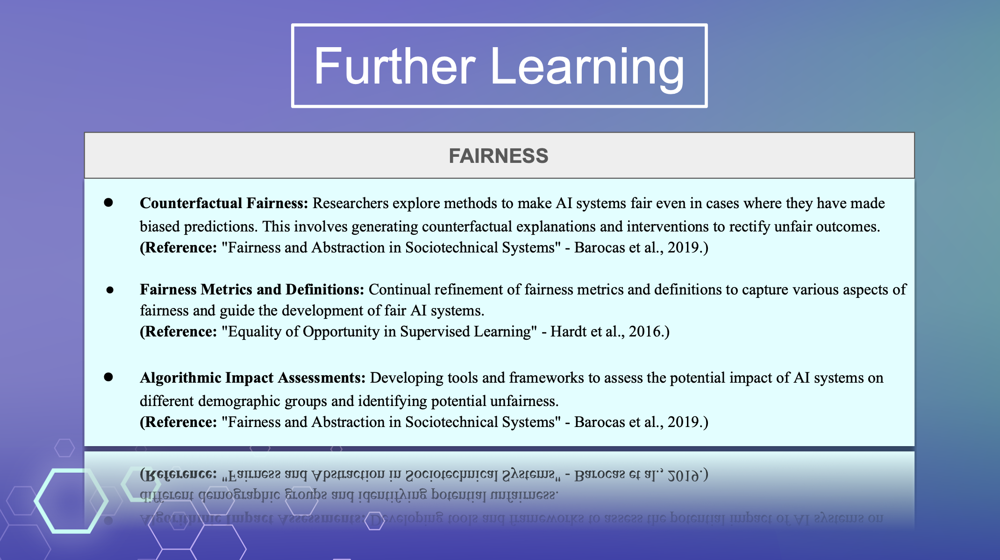

# Resources for Further Learning
## More Research into AI Bias
The integration of technology into societal problem-solving has led to both remarkable advancements and complex challenges. While technical aspects may appear exciting, ethical concerns, fairness considerations, and broader societal implications require continuous exploration and refinement. The emergence of AI Bias as a crucial topic prompts us to delve into its multifaceted dimensions, where transparency and fairness always stand as two of the most pivotal research directions.

 

## Transparency in AI Bias:
 
In the paper "Towards A Rigorous Science of Interpretable Machine Learning" by Dr. Lipton, the significance of building a comprehensive framework for interpretable machine learning is highlighted. As machine learning models become increasingly intricate, their lack of interpretability poses challenges to understanding and trusting their decisions. The paper advocates a systematic approach involving evaluation metrics, domain knowledge integration, and human feedback to enhance interpretability.
However, the concept of transparency has extended beyond technical realms in many cases; it usually also encompasses data privacy concerns in everyday situations, as evidenced by the examination of AI's role in biomedical research and consent processes. In the article “AI, big data, and the future of consent”, Dr. Kearn mentioned that patients have almost no autonomy in the re-purposed data problem.  Likewise, Ai Bias also arises when users are not given alternative choices in cases where they do not wish to consent.  In fact, users who currently do not wish to comply with the terms and conditions lack the power to renegotiate.

## Fairness in AI Bias:
 
Addressing fairness in AI goes beyond pure algorithmic solutions. Dr. Barocas proposes a holistic approach in "Fairness and Abstraction in Sociotechnical Systems" emphasizing the amalgamation of algorithmic design and systemic societal factors to achieve meaningful fairness. Similarly, Dr. Hardt's work on "Equality of Opportunity in Supervised Learning" introduces fairness metrics that balance error rates among different subgroups while maximizing classifier accuracy. Such R&D cases are all going to underscore the importance of considering broader societal contexts and interdisciplinary collaboration in ensuring fairness.

## Importance of Ongoing Studies
AI Bias as a nascent topic is an ongoing revolution, the significance will keep intensifying as AI becomes further integrated into society. Whether in the workplace, healthcare, or marginalized group treatment, the awareness of biases and issues must be met with a comprehensive response that transcends individual disciplines. Therefore, the interdisciplinary nature of this challenge mandates the involvement of more and more far studies from diverse perspectives, as highlighted by the various research directions discussed.
Overall, starting from the realization of AI Bias existence, continuous learning, research, and collaboration are essential to navigate the complexities of AI Bias. And is going to further guide the AI evolution towards a genuinely beneficial technology for the whole society.
